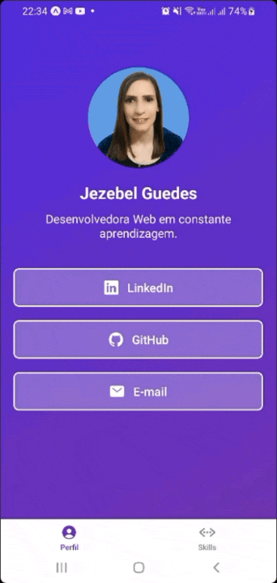

# Portfólio App
---

<!-- project badges --> 
<p align="center"> 
 

 

 

 
</p>
</div>

## 📌 Sobre o Projeto

Este projeto foi desenvolvido como parte do **desafio do Bootcamp da [DIO](https://www.dio.me/en/bootcamp/meutudo-mobile-developer)**.  
O objetivo foi criar um **aplicativo mobile** utilizando **React Native + TypeScript**, com duas telas principais: **Perfil** e **Habilidades**.

---


## 🚀 Funcionalidades

### **Main Screen (Perfil)**
- 📸 Foto de perfil
- 🧑‍💻 Nome da desenvolvedora
- Breve descrição
- 🔗 Botões com links importantes para se conectar com você:
  - LinkedIn
  - GitHub
  - E-mail

### **Skill Screen (Habilidades)**
- 📸 Foto de perfil
- 🧑‍💻 Titulo de Minhas Habilidades
- 🌱 Lista de habilidades
- ⭐ Avaliação de proficiência com ícones de estrelas
- 📲 Botão para falar via **WhatsApp**

---

## 🛠️ Tecnologias Utilizadas

Este projeto foi desenvolvido utilizando as seguintes tecnologias e bibliotecas:

- [React Native 0.79.6](https://reactnative.dev/) → Framework para desenvolvimento mobile
- [React 19](https://react.dev/) → Biblioteca base para construção de interfaces
- [Expo 53](https://expo.dev/) → Ferramenta para facilitar o desenvolvimento e build do app
- [TypeScript 5](https://www.typescriptlang.org/) → Superset do JavaScript com tipagem estática
- [React Navigation](https://reactnavigation.org/) → Navegação entre telas
  - `@react-navigation/native`
  - `@react-navigation/bottom-tabs`
- [Expo Linear Gradient](https://docs.expo.dev/versions/latest/sdk/linear-gradient/) → Gradientes no background
- [Expo Status Bar](https://docs.expo.dev/versions/latest/sdk/status-bar/) → Controle da barra de status
- [Expo Linking](https://docs.expo.dev/versions/latest/sdk/linking/) → Para abrir links externos (LinkedIn, GitHub, Email, WhatsApp)
- [React Native Safe Area Context](https://github.com/th3rdwave/react-native-safe-area-context) → Ajustes para áreas seguras em diferentes dispositivos
- [React Native Screens](https://github.com/software-mansion/react-native-screens) → Melhor performance na navegação

---

## 📱 Demonstração
<div align="center"> <a href="#">  </a> </div>

---

## ⚙️ Pré-requisitos

Antes de começar, você precisa ter instalado em sua máquina:

- [**Node.js**](https://nodejs.org/) (versão LTS recomendada)
- [**npm**](https://www.npmjs.com/)
- [**Expo CLI**](https://docs.expo.dev/get-started/installation/) (opcional, pode usar `npx expo start`)

---

## ▶️ Como Rodar o Projeto

```bash
# Clone este repositório
git clone https://github.com/Jezebel1990/react-native-portfolio-app.git

# Acesse a pasta do projeto
cd react-native-portfolio-app

# Instale as dependências
npm install

# Inicie o projeto
npx expo start
```
Depois, basta escanear o QR Code com o aplicativo Expo Go no seu celular.

---
## Autora
Feito com ❤️ por [Jezebel Guedes](https://www.linkedin.com/in/jezebel-guedes/) 👋Vamos nos conectar!